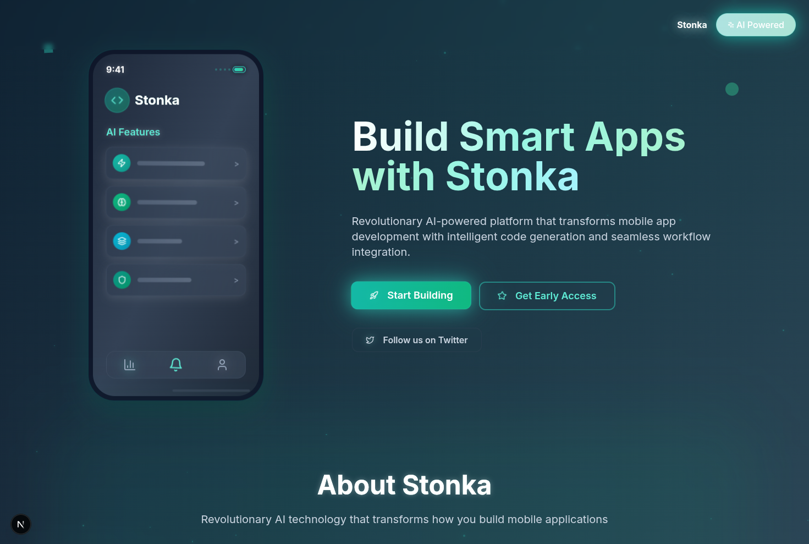

# Stonka Landing Page

A modern, responsive landing page for Stonka, an AI-powered mobile app development platform. Built with Next.js, TypeScript, and Tailwind CSS.

## Preview 



## Overview

This project showcases a professional landing page featuring:
- Dynamic particle animations
- Interactive UI components
- Responsive design for all devices
- Modern gradient backgrounds and effects
- Comprehensive sections including features, FAQ, tokenomics, and support

## Technologies Used

- **Framework**: Next.js 14
- **Language**: TypeScript
- **Styling**: Tailwind CSS
- **UI Components**: shadcn/ui
- **Icons**: Lucide React
- **Animations**: Custom CSS animations

## Installation

1. Clone the repository:
   ```bash
   git clone https://github.com/yourusername/stonka-landing.git
   cd stonka-landing
   ```

2. Install dependencies:
   ```bash
   npm install
   ```

3. Run the development server:
   ```bash
   npm run dev
   ```

4. Open [http://localhost:3000](http://localhost:3000) in your browser.

## Project Structure

```
stonka-landing/
├── app/
│   ├── globals.css
│   ├── layout.tsx
│   └── page.tsx
├── components/
│   ├── ui/          # shadcn/ui components
│   └── theme-provider.tsx
├── lib/
│   └── utils.ts
├── public/          # Static assets
└── styles/
    └── globals.css
```

## Features

- **Responsive Design**: Optimized for mobile, tablet, and desktop
- **Interactive Elements**: Hover effects, animations, and transitions
- **Modern UI**: Gradient backgrounds, glassmorphism effects
- **Accessibility**: Proper semantic HTML and ARIA attributes
- **Performance**: Optimized images and efficient animations

## Development

This project demonstrates expertise in:
- Modern React development with Next.js
- TypeScript for type safety
- Tailwind CSS for utility-first styling
- Component-based architecture
- Custom animations and interactions
- Responsive web design principles

## Deployment

The application can be deployed to Vercel, Netlify, or any static hosting service:

```bash
npm run build
npm run start
```

## License

This project is licensed under the MIT License - see the [LICENSE](LICENSE) file for details.